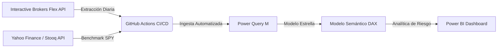

# Portfolio & Financial Risk Analytics Engine

Sistema integral de inteligencia financiera diseñado para automatizar la extracción de datos, modelado cuantitativo de riesgo y reportería ejecutiva para portafolios de inversión.

---

## 🏛️ Arquitectura del Pipeline

---

## 📊 Modelo Relacional (Esquema Estrella)

* **Tablas de Hechos (Fact Tables):**
  * `Fact_PortfolioDaily`: Valor liquidativo diario (NAV), flujos de efectivo y saldo Mark-to-Market.
  * `Fact_Trades`: Registro atómico de ejecuciones, tamaño de órdenes, PnL realizado y comisiones.
  * `Fact_Dividends`: Dividendos brutos, retenciones fiscales (Withholding Tax) y pagos netos.
  * `Fact_Benchmark_SPY`: Precios de cierre ajustados y retornos diarios del S&P 500.
* **Tablas de Dimensiones (Dim Tables):**
  * `Dim_Calendario`: Eje temporal maestro continuo.
  * `Dim_Asset`: Clasificación dinámica por clase de activo (Renta Variable, Renta Fija, Materias Primas, Crypto).
  * `Dim_CambioNAV`: Jerarquía contable para la conciliación de variación patrimonial.

---

## 📐 Métricas Cuantitativas Implementadas (DAX)

* **Sharpe Ratio (1Y):** Relación de retorno ajustado por riesgo sobre volatilidad anualizada ($\sigma \times \sqrt{252}$).
* **Maximum Drawdown (Underwater Curve):** Máxima caída porcentual histórica de capital desde el pico más alto.
* **Alpha vs. SPY:** Exceso de retorno acumulado de la cartera respecto al benchmark en Base 100.
* **Conciliación Contable (Waterfall):** Cuadratura exacta entre depósitos netos, MTM, ingresos por dividendos, deducciones por tasas y retenciones fiscales frente al NAV final.

---

## 🛠️ Retos de Ingeniería Resueltos

* **Deduplicación dinámica en Power Query (M):** Limpieza y control de solapamiento temporal en extracciones programadas de la API.
* **Alineación temporal con Benchmark:** Sincronización continua de días bursátiles y no hábiles mediante `Dim_Calendario`.
* **Conciliación de flujos contables:** Eliminación de duplicidades en totales calculados del gráfico de cascada.
